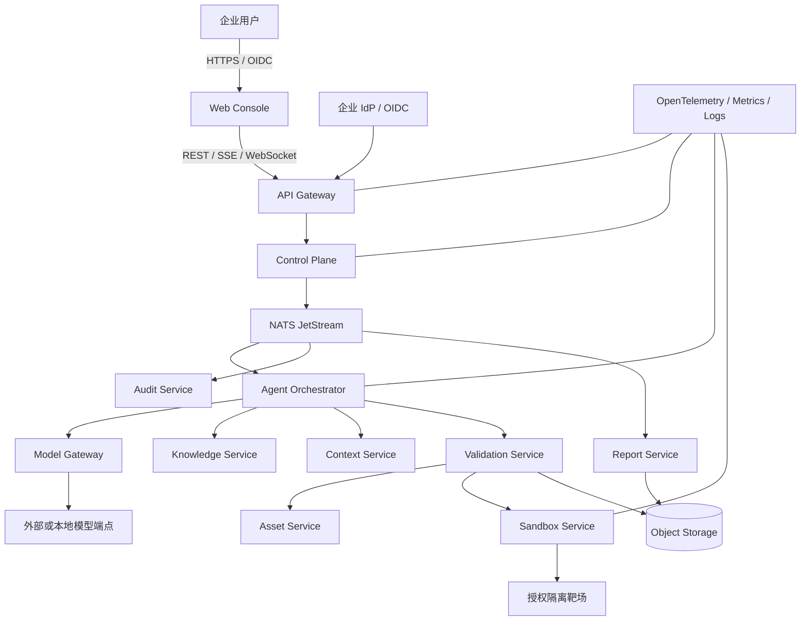

# 系统上下文、信任边界与服务职责

## 1. 架构策略

目标采用领域化服务架构和 Monorepo 管理。服务边界按数据所有权与安全职责划分，不按文件数量或技术语言划分。MVP 可共享 PostgreSQL、NATS、Redis 和对象存储集群，但每个服务必须使用独立 schema、独立数据库账号和独立对象前缀。

内部模块可以先以同进程方式部署，但必须通过接口组合，不能依赖跨模块内部表；拆为独立进程时不得改变领域契约。

## 2. 系统上下文



## 3. 信任区

| 信任区 | 组件 | 基本策略 |
|---|---|---|
| Z0 不可信客户端 | 浏览器、CLI、上传文件 | 所有输入验证；不接受客户端提供的最终 tenant/role；禁止 secret 入 URL |
| Z1 外部接入 | Gateway、WAF、OIDC 回调 | JWT 校验、限流、CSRF/XSS 安全头、request/trace ID、后端再鉴权 |
| Z2 控制平面 | Control Plane、Asset、Audit、Report | 无直接目标访问；最小数据库账号；服务间 mTLS/短期身份 |
| Z3 AI 数据平面 | Orchestrator、Model、Knowledge、Context | 模型/RAG 均不可信；只产生建议；不能签发授权 |
| Z4 隔离执行平面 | Validation、Sandbox worker | 独立 Linux 节点；默认无外网；只接受签名执行授权 |
| Z5 授权目标 | 本地靶场、隔离容器/VM、明确授权环境 | Scope、时间窗、端口、速率和证据要求均需匹配 |
| Z6 外部依赖 | 模型供应商、IdP、Vault/KMS | 明确 allowlist、TLS、超时、熔断、数据最小化和审计 |

高信任区不能因为调用来自内部网络而跳过身份、权限和策略校验。

## 4. 服务职责与禁止项

| 服务 | 唯一拥有的数据 | 允许职责 | 禁止职责 |
|---|---|---|---|
| `web-console` | 无领域真相 | 页面、路由、查询缓存、虚拟列表、实时展示、生成 SDK | 保存明文凭据、决定权限、拼接任意命令 |
| `api-gateway` | 会话/限流短期状态 | OIDC/JWT、路由、请求追踪、限流、SSE/WS 汇聚 | 领域状态迁移、直接访问业务表 |
| `control-plane` | Tenant、Organization、Membership、Project、Task、TaskStage、Policy、Approval、Config | IAM 集成、RBAC/ABAC、任务聚合、调度、策略、审批、outbox | 直接调用模型、主动连接目标、运行沙箱 |
| `agent-orchestrator` | Agent/Skill/Workflow 版本、TaskExecution、ToolCall 意图 | 有界工作流、Agent 调度、预算、重试、结果归并 | 自行扩大 scope、执行任意工具、写 Task 真相表 |
| `model-gateway` | CredentialRef、Provider、ModelInstance、ModelCall、Quota | 适配、路由、流式、限流、熔断、成本、脱敏 | 依赖供应商 SDK 于核心域、授予工具权限 |
| `knowledge-service` | KnowledgeBase、Document、Version、Chunk、索引元数据 | 扫描、版本、分块、混合检索、重排、ACL、引用 | 将文档内容作为系统指令或授权依据 |
| `context-service` | MemoryEntry、ContextSnapshot | 短期上下文、摘要、记忆、快照、污染检测 | 保存审批真相、从摘要恢复权限 |
| `asset-service` | Asset、Endpoint、AuthorizationScope、ScopeTarget、AuthorizationDocument | 资产、授权范围、有效期、时间窗、工具和速率约束 | 无 Validation/Sandbox 直接探测 |
| `validation-service` | Candidate、ValidationPlan、ValidationExecution、Evidence、Review | 候选、计划、风险预检、证据、成功条件和复核 | 在 API 容器/宿主机执行 payload |
| `sandbox-service` | SandboxTemplate、Instance、Run | 隔离生命周期、配额、网络、执行、日志、快照、回收 | 自行判断业务风险、接受未注册工具或 shell 字符串 |
| `audit-service` | AuditEvent、AuditAnchor | 追加审计、查询、hash chain、外部锚定 | 普通 UPDATE/DELETE、保存未脱敏 secret |
| `report-service` | Report、Artifact、ExportJob、Notification | 来源可追踪报告、导出、通知 | 修改原始证据、生成无引用结论 |

## 5. 数据所有权规则

1. 一个实体只有一个写入服务；其他服务保存其 ID 和必要快照，不共享 ORM model。
2. MVP 可使用单 PostgreSQL 集群，但 schema/role 必须为 `control`、`orchestrator`、`model`、`knowledge`、`context`、`asset`、`validation`、`sandbox`、`audit`、`report`。
3. 跨服务关系不建立数据库外键；通过 API 校验和事件投影维持一致性。
4. 每个服务事务内写领域记录和 outbox；消费者用 inbox 对 `event_id` 去重。
5. 大日志、文档、证据、报告存对象存储；数据库只保存 hash、URI、大小、媒体类型和保留级别。
6. Redis 只保存缓存、限流、短租约和可重建投影，不能作为 Task 或审批唯一真相源。
7. NATS 负责 durable command/event，不保存需要永久查询的唯一业务记录。

## 6. 同步与异步边界

### 同步调用

- 身份/权限快速校验。
- Asset Scope 读取和策略预检。
- 知识检索、上下文读取和模型请求。
- 健康检查、短查询、命令接收。

同步调用必须有超时、取消、有限重试和熔断。重试仅用于幂等操作。

### 异步事件

- `task.submitted.v1`
- `policy.decision.created.v1`
- `approval.requested.v1`
- `approval.completed.v1`
- `task.queued.v1`
- `task.stage.changed.v1`
- `sandbox.run.requested.v1`
- `sandbox.run.completed.v1`
- `evidence.created.v1`
- `report.ready.v1`
- `audit.event.v1`

事件信封至少包含：

```text
event_id, event_type, schema_version, occurred_at,
trace_id, request_id, tenant_id, project_id,
aggregate_type, aggregate_id, aggregate_version,
producer, correlation_id, causation_id, payload
```

事件不得携带 secret、大段日志、完整文档或完整证据正文。

## 7. Policy Engine 的位置

`packages/policy-engine` 是无 I/O 的规则计算库；Policy 和 Approval 数据归 control-plane。Control Plane 提供 PDP，Gateway、Orchestrator、Validation 和 Sandbox 是 PEP。

任何 PEP 都不能把上游的 `ALLOW` 当成永久授权。执行点必须检查短期 ExecutionGrant、digest、动态网络事实、有效期和撤销状态。

## 8. 初始部署轮廓

P0 Compose 基础设施建议包含：

```text
postgres
redis
nats (JetStream)
minio
development OIDC provider
otel-collector
prometheus
```

P0 应用仅需真实 health/readiness、配置校验、数据库连接、事件 smoke 和可观测性 smoke。不得为了展示目录而创建返回固定成功的假业务端点。

P1–P4 可以将低风险服务作为独立进程逐步启用。Sandbox worker 必须始终是独立 Linux 执行节点，不能与 API 进程合并部署。

## 9. 旧原型迁移映射

| 原文件 | 临时定位 | 最终所有者 |
|---|---|---|
| `app.py` | 兼容 API adapter | Gateway/各服务 API 按契约拆分 |
| `db.py` | characterization 数据基线 | 各服务 PostgreSQL migrations |
| `security.py` | API Key 兼容和 redaction | Control Plane + shared security |
| `orchestrator.py` | 单机行为参考 | Control Plane + Agent Orchestrator |
| `model_gateway.py` | Provider 行为参考 | Model Gateway |
| `scope.py` | Scope 安全规则参考 | Asset Service |
| `sandbox.py` | argv/资源策略参考 | Sandbox Service |
| `context.py` | 快照/清洗参考 | Context Service |
| `rag.py` | ACL/来源参考 | Knowledge Service |
| `audit.py` | hash chain 参考 | Audit Service |

迁移完成的判据不是文件已移动，而是：目标服务拥有独立契约、独立数据、无跨库读取、测试迁移且旧入口不再承担该领域写入。

## 10. 架构门禁

- Control Plane 不得导入模型供应商 SDK 或容器运行时 SDK。
- Orchestrator 不得持有目标网络凭据或直接打开目标 socket。
- Sandbox 不得访问 control-plane 数据库。
- Model Gateway 不得读取 Task、Scope 或 Evidence 表。
- Knowledge/Context 返回值必须带来源和安全标签，不能返回 `authorized=true`。
- Audit 服务账号没有普通业务表写权限；普通服务账号没有 AuditEvent 更新权限。
- 高风险执行在审计 outbox 无法持久化时必须失败关闭。
