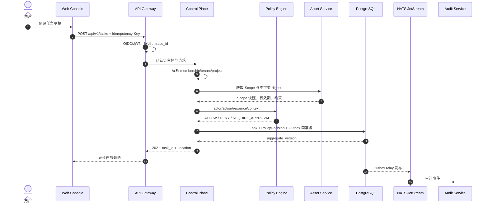
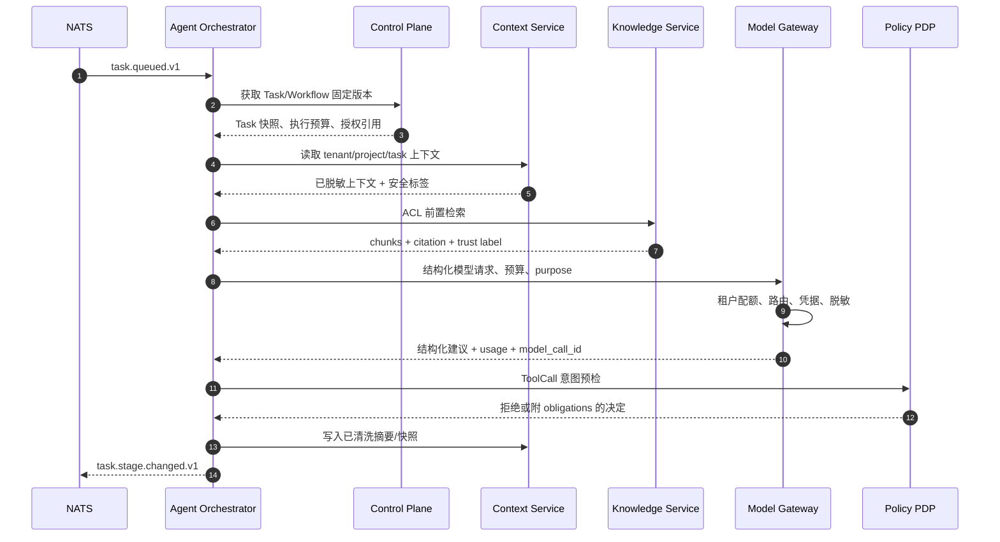
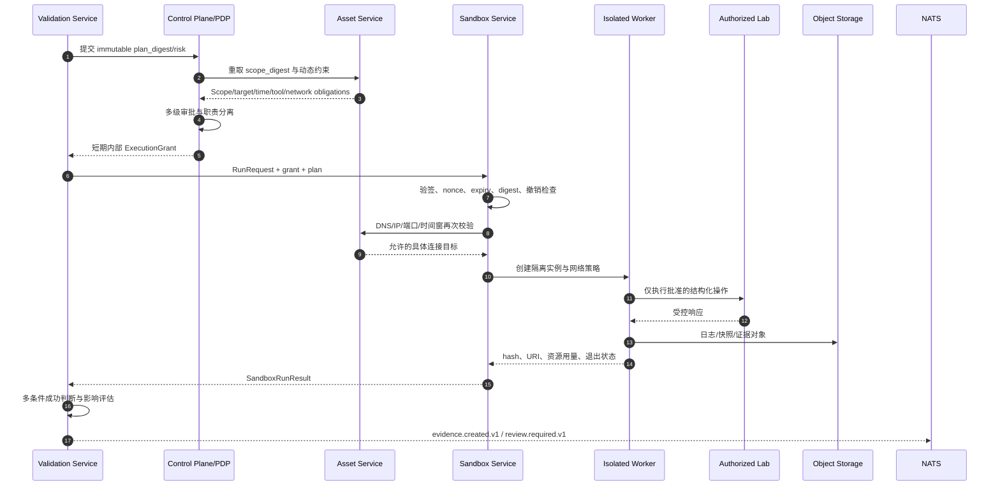

# 关键数据流与控制流

## 1. 总体约束

数据流遵循以下顺序：身份解析 → 数据范围 → 权限 → 策略 → 审批 → 执行点复验 → 隔离执行 → 证据 → 复核 → 报告 → 审计。

模型、Agent、RAG、上下文和客户端都不能缩短这条链。任何高风险路径缺少其中一环都必须失败关闭。

## 2. 数据分类

| 分类 | 示例 | 存储和传输要求 |
|---|---|---|
| Public | 产品公开说明、公开 CVE 元数据 | TLS；允许按公开 ACL 检索 |
| Internal | 项目文档、普通任务元数据 | tenant/project 隔离；禁止公开导出 |
| Restricted | 源代码、授权范围、验证证据、内部报告 | 项目 ACL、加密、导出审批、完整审计 |
| Secret | API Key、Token、私钥、数据库密码 | 仅 Vault/KMS 或等价 secret manager；write-only；不得进入业务事件 |
| Immutable Audit | 审批决定、审计事件、证据 hash/来源链 | 追加式、独立权限、保留策略、外部锚定 |

## 3. 任务创建、审批和调度



若 PDP 返回 `REQUIRE_APPROVAL`，control-plane 创建不可变 ApprovalRequest 和 ApprovalStep。只有全部步骤完成且未过期，才把任务转为 `QUEUED`。

客户端提交的 `tenant_id`、角色、审批状态和 scope digest 都不可信；服务端必须从身份和当前数据重新解析。

## 4. Agent、模型、知识与上下文协同



关键规则：

- RAG 文本必须包装为 `untrusted_evidence`，不得合并进系统授权指令。
- Model Gateway 只接受允许的 message roles，系统策略由平台注入。
- ToolCall 必须引用注册的 Skill/Tool 版本和 JSON Schema，模型不能创造新工具。
- Agent 循环、Token、成本、工具次数和总时长都有硬上限。
- ContextSnapshot 只能恢复知识状态；权限、Scope 和 Approval 必须从当前控制面重新加载。

## 5. 受控验证与 Sandbox 流

本数据流从 P5/P6 才允许启用。P0 只能验证契约和合成事件，不能创建实际 ValidationExecution。



ExecutionGrant 不返回浏览器，至少绑定：

```text
grant_id, tenant_id, project_id, task_id, plan_id,
scope_digest, plan_digest, policy_bundle_digest,
allowed_tool_versions, target/IP/port/protocol,
network/resource/time obligations, approval_ids,
issued_at, expires_at, nonce, signature
```

以下情况必须拒绝并记录命中的策略：digest 变化、审批撤销、grant 过期、nonce 已使用、DNS 变化越界、时间窗结束、端口/工具不匹配、审计 outbox 无法持久化。

## 6. 证据、复核和报告

1. Sandbox 只生成运行事实和对象 hash，不声明漏洞成立。
2. Validation Service 根据显式成功条件、patched 对照、版本匹配和多种证据形成候选结论。
3. Evidence 元数据记录 execution、sandbox、tool、target、timestamp、collector、hash、大小、媒体类型和 redaction 状态。
4. 高风险验证必须进入人工 Review；Reviewer 只能接受、拒绝或要求修订，不能改写原证据。
5. Report Service 只引用已复核 Evidence/Citation，生成新的版本化报告和 artifact hash。
6. 导出依据数据分类再次执行策略和审批，导出事件进入审计。

## 7. 知识导入流

```text
上传请求
→ 文件名/路径/类型/大小校验
→ 恶意文件与压缩炸弹检查
→ tenant/project/classification 确定
→ 原文件写对象存储并记录 hash
→ DocumentVersion
→ 可配置分块
→ 通过 Model Gateway 生成 embedding
→ 关键词/向量索引
→ 质量评分和可检索状态
```

删除文档创建 tombstone 并异步删除索引，不复写历史引用。历史报告引用的版本按保留策略继续可审计。

## 8. 实时事件流

- Control Plane 保存任务事件投影和单调递增序号。
- Gateway 提供 tenant/project 过滤后的 SSE；支持 `Last-Event-ID` 断点恢复。
- 心跳不携带领域数据。
- 慢客户端使用有界缓冲；溢出时断开并要求按序号重连，不能无限占用内存。
- 前端日志列表只接收增量摘要，完整日志按授权从对象存储分页读取。

## 9. 审计流

所有服务在本地事务写 audit outbox，Audit Service 幂等消费。关键事件至少包括：

```text
登录、权限/角色变更、配置变更、模型/工具/技能调用、
Task/Stage/Execution 状态迁移、PolicyDecision、ApprovalDecision、
Scope 变更、Sandbox 生命周期、命令/网络/文件行为、
知识更新、证据创建、报告与数据导出。
```

每条事件包含 `trace_id/request_id/task_id/tenant_id/user_id/agent_id/sandbox_id/timestamp/result/duration/risk_level` 中适用的字段。脱敏发生在 outbox 落库之前。

## 10. 失败与恢复

| 故障 | 处理 |
|---|---|
| API 超时但事务已提交 | 客户端用 Idempotency-Key 重试并获得同一资源 |
| Outbox 发布失败 | 保留未发布记录，指数退避；不丢领域事务 |
| 消息重复 | Consumer inbox 按 event_id 去重 |
| 消息乱序 | aggregate_version 小于等于当前版本时忽略；有缺口时延迟/重放 |
| Worker 丢失 | 租约过期；新 worker 获取更高 fencing token；旧 worker 结果被拒绝 |
| 模型失败 | 有界重试、熔断、备用模型；不得降级为绕过策略执行 |
| Sandbox 超时 | 发取消、强制终止、资源回收、保存已有证据和超时状态 |
| 审批撤销 | 发布撤销事件；未执行 grant 失效；运行中任务进入 CANCELLING |
| Audit Service 暂时不可用 | 本地 outbox 持久化；若 outbox 写失败，高风险执行拒绝 |
| 对象存储失败 | 不声明 Evidence/Report 已完成；进入可重试失败 |
