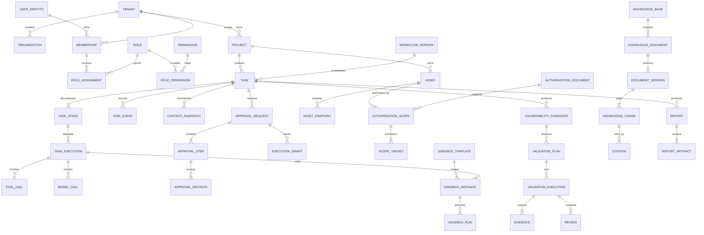

# 核心领域模型与初步 ER

## 1. 建模原则

1. 按聚合和服务数据所有权建模，不构造跨服务共享大对象。
2. 核心业务字段规范化；JSONB 只保存确实动态、已由 Schema 约束的结构。
3. 所有多租户表包含 `tenant_id`；项目域表包含 `project_id`。
4. 所有可变聚合根包含 `version bigint`，更新使用乐观锁。
5. 定义类对象允许显式软删除；审批、执行、证据和审计采用追加/归档，不允许覆盖历史。
6. 跨服务只保存逻辑 ID 和必要快照，不建立跨服务数据库外键。
7. 时间统一保存 UTC，API 使用 RFC 3339。
8. Secret 只保存 `secret_ref`、fingerprint、版本、状态和轮换时间。

## 2. 通用字段

可变核心实体统一字段：

```text
id UUIDv7 或 ULID
tenant_id UUID
project_id UUID（项目范围实体）
version bigint NOT NULL DEFAULT 1
created_at timestamptz
updated_at timestamptz
created_by UUID
updated_by UUID
deleted_at timestamptz（仅明确支持软删除的定义类实体）
```

追加实体使用 `occurred_at/recorded_at`，没有 `updated_at`。所有 ID 由服务端生成。

## 3. 聚合与实体所有权

### 3.1 Identity/Tenancy 聚合（Control Plane）

| 实体 | 关键字段与约束 |
|---|---|
| Tenant | `name/status/data_region/config_version`；名称在平台范围唯一 |
| Organization | `tenant_id/parent_id/name`；防止循环层级 |
| UserIdentity | 外部 subject、issuer、display name、状态；不保存 IdP 密码 |
| Membership | `tenant_id/user_id/org_id/status`；同一租户成员唯一 |
| Role | 系统/租户自定义角色、scope type、状态 |
| Permission | 稳定 permission code，如 `task.execute` |
| RolePermission | Role 与 Permission 多对多 |
| RoleAssignment | membership、role、project、有效期、授予者 |
| Project | `tenant_id/organization_id/name/status/classification` |

### 3.2 Task/Governance 聚合（Control Plane）

| 实体 | 关键字段与约束 |
|---|---|
| Task | workflow_version、title、status、risk、scope_id/digest、approval_status、deadline、idempotency_key |
| TaskStage | task、node key、status、dependency count、attempt policy、deadline |
| TaskEvent | task、sequence、from/to、actor、cause、payload Schema；追加式 |
| Policy | name、scope、priority、effect、状态 |
| PolicyVersion | policy、version、document、hash、published_at；发布后不可改 |
| PolicyBinding | policy_version 与 tenant/project/asset/workflow 的绑定 |
| PolicyDecision | input digest、decision、reasons、matched policies、obligations；追加式 |
| ApprovalRequest | resource/action/risk、scope/plan/policy digest、status、expires_at |
| ApprovalStep | sequence、required role/group、quorum、status |
| ApprovalDecision | step、approver、decision、reason、timestamp、signature；追加式 |
| ExecutionGrant | request、nonce hash、bound digests、obligations、expiry、revoked/used 时间 |

### 3.3 Agent/Workflow 聚合（Agent Orchestrator）

| 实体 | 关键字段与约束 |
|---|---|
| AgentDefinition/AgentVersion | role、input/output Schema、tools、data scopes、budget、risk、retry、timeout |
| SkillDefinition/SkillVersion | input/output Schema、permissions、risk、resources、executor、approval requirement |
| AgentSkillBinding | agent version、skill version、configuration、enabled |
| WorkflowDefinition/WorkflowVersion | DAG、input/output Schema、risk、发布状态、content hash |
| WorkflowNode/WorkflowEdge | 类型化节点、依赖、条件、补偿节点；发布版本不可改 |
| TaskExecution | task/stage、attempt、worker、lease/fencing、status、started/finished |
| ToolCall | execution、tool version、input/output digest、policy decision、status、duration |

### 3.4 Model 聚合（Model Gateway）

| 实体 | 关键字段与约束 |
|---|---|
| CredentialRef | tenant/project、secret backend/ref、fingerprint、key version、status、rotated_at |
| ModelProvider | kind、base endpoint、credential_ref、enabled、timeout、rate limit |
| ModelInstance | provider、model/version、capabilities、context length、quantization、resource metadata |
| ModelRoute | purpose/capability、candidate instances、priority/weight、fallback rule |
| ModelQuota | tenant/project/model、token/cost/concurrency window |
| ModelCall | task/execution、instance、request/response digest、tokens、cost、latency、outcome |

### 3.5 Knowledge/Context 聚合

| 实体 | 所有者 | 关键字段与约束 |
|---|---|---|
| KnowledgeBase | Knowledge | classification、ACL policy、embedding/index config |
| KnowledgeDocument | Knowledge | kb、logical source、status、current version |
| DocumentVersion | Knowledge | source URI、object URI、content hash、media type、version、expiry |
| KnowledgeChunk | Knowledge | version、ordinal、text/object ref、hash、embedding、token count |
| Citation | Knowledge | chunk/version、locator、quote digest |
| MemoryEntry | Context | task/agent、visibility、classification、content/ref、source、expiry |
| ContextSnapshot | Context | task、stage、summary、facts、citation refs、token count、state hash |

### 3.6 Asset/Validation/Sandbox 聚合

| 实体 | 所有者 | 关键字段与约束 |
|---|---|---|
| Asset | Asset | type、canonical identifier、environment、owner、criticality、status |
| AssetEndpoint | Asset | protocol、host/IP/CIDR、port、repository/path、labels |
| AuthorizationDocument | Asset | object URI、hash、issuer、validity、classification |
| AuthorizationScope | Asset | asset、validity、time windows、tools、rate/resource limits、status、digest |
| ScopeTarget | Asset | normalized target type/value、protocol、ports、path constraints |
| VulnerabilityCandidate | Validation | task、asset、type、summary、confidence、risk、source citations |
| ValidationPlan | Validation | candidate、revision、typed steps、success conditions、plan hash、risk |
| ValidationExecution | Validation | plan revision、grant、sandbox run、status、outcome、impact summary |
| Evidence | Validation | execution、kind、summary、artifact hash、collector、collected_at、chain metadata |
| Review | Validation | execution、reviewer、decision、reason、timestamp；追加式 |
| SandboxTemplate | Sandbox | image digest、runtime、seccomp/MAC/network/resources、signature、status |
| SandboxInstance | Sandbox | template、task/execution、worker、fencing、status、expiry |
| SandboxRun | Sandbox | instance、typed command/tool、input/output hash、exit、resource usage、timestamps |

### 3.7 Audit/Report 聚合

| 实体 | 所有者 | 关键字段与约束 |
|---|---|---|
| AuditEvent | Audit | actor/action/resource/result、trace、risk、redacted details、prev/hash；追加式 |
| AuditAnchor | Audit | range、head hash、external WORM receipt、anchored_at |
| Report | Report | task/project、type、version、status、evidence/citation set hash |
| ReportArtifact | Report | report、format、object URI、hash、classification、generated_at |
| ExportJob | Report | report/artifact、requester、policy/approval、status、destination class |
| Notification | Report | recipient/channel/template、resource ref、status；不包含 secret/证据正文 |

## 4. 核心关系图



图中跨服务线只表示逻辑引用，不表示数据库外键。

## 5. 聚合不变量

### Task

- 同一 `tenant_id + idempotency_key + operation` 只能创建一个逻辑 Task。
- Task 必须引用已发布且不可变的 WorkflowVersion。
- `QUEUED/RUNNING` 必须绑定当前有效的 scope digest 和所需审批。
- 状态变化必须递增 version 并追加 TaskEvent/outbox。

### AuthorizationScope

- 发布或审批后的 revision 不可编辑。
- digest 覆盖 target、protocol、ports、path、tools、validity、time windows、rate/resource limits 和授权文档 hash。
- Scope 过期、撤销或授权文件失效时，所有关联未执行 grant 失效。

### ApprovalRequest/ExecutionGrant

- ApprovalDecision 不允许 UPDATE/DELETE。
- 创建者不能审批；高风险步骤的审批人互不相同。
- grant 绑定 digest、审批链、义务、有效期和一次性 nonce。

### Evidence

- Evidence 不声明漏洞成功，只声明可复核事实。
- artifact hash、来源 execution、采集器、时间和 chain metadata 必填。
- 修订结论创建新 Review/Report 版本，不能修改原 Evidence。

## 6. 索引与约束基线

- 高频多租户索引以 `(tenant_id, project_id, ...)` 开头。
- Task：`(tenant_id, project_id, status, created_at DESC)`、唯一幂等索引。
- TaskEvent：唯一 `(task_id, sequence)`。
- Approval：`(tenant_id, status, expires_at)`，Decision 唯一 `(step_id, approver_id)`。
- ScopeTarget：规范化值使用精确/网络类型索引，不只保存文本。
- Knowledge：classification/ACL 过滤必须在关键词/向量候选生成前生效。
- ModelCall/AuditEvent 按月分区，索引 trace/task/tenant/timestamp。
- ExecutionGrant nonce 唯一，使用状态条件更新防止重复执行。
- 所有外部 URL、对象 URI、model endpoint 必须经过类型和 scheme 约束。

## 7. JSONB 使用边界

允许 JSONB：已版本化的 Workflow DAG、Policy 文档、Agent/Skill Schema、模型 capability、动态 labels、脱敏事件 details。

不允许 JSONB 代替：Tenant、Project、Membership、RoleAssignment、Task/Stage/Execution、ApprovalStep/Decision、ScopeTarget、Evidence 元数据等核心关系。

每个 JSONB 字段必须有 `schema_version`，在服务边界进行 Schema 校验，并提供兼容迁移策略。

## 8. 删除、保留与归档

| 数据 | 在线保留 | 归档/删除原则 |
|---|---|---|
| 定义/配置 | 保留所有已引用版本 | 未引用草稿可软删；发布版本不可覆写 |
| Task/Execution | 按租户政策 | 先归档；保留可重建状态和审计引用 |
| Context/Memory | 短期、按任务和分类 | 过期自动清理；授权真相不依赖其存在 |
| 知识原文/Chunk | 按来源许可和分类 | tombstone + 异步索引删除；历史引用保留 hash |
| Evidence/Report | 按安全/合规政策 | Restricted 加密；法务保留优先于删除请求 |
| Audit/Approval | 长期追加 | 不允许普通用户删除；归档到 WORM |
| Secret | 仅 secret manager | 吊销后按密钥政策销毁；业务库仅留不可逆 fingerprint |

具体期限由租户/法规配置决定，但任何删除都必须产生审计事件并验证对象、索引和备份处理结果。

## 9. 迁移要求

- 每个服务独立 migration 目录和 schema owner。
- migration 必须提供前向和回滚路径；不可逆操作需 expand/contract 两阶段和恢复脚本。
- 迁移先在空库、旧版本快照和生产规模抽样数据上验证。
- 跨版本部署期间，事件和 API 至少保持一个发布窗口的向后兼容。
- 旧 SQLite 只作为导入来源，不能在目标系统继续充当双写真相源。
