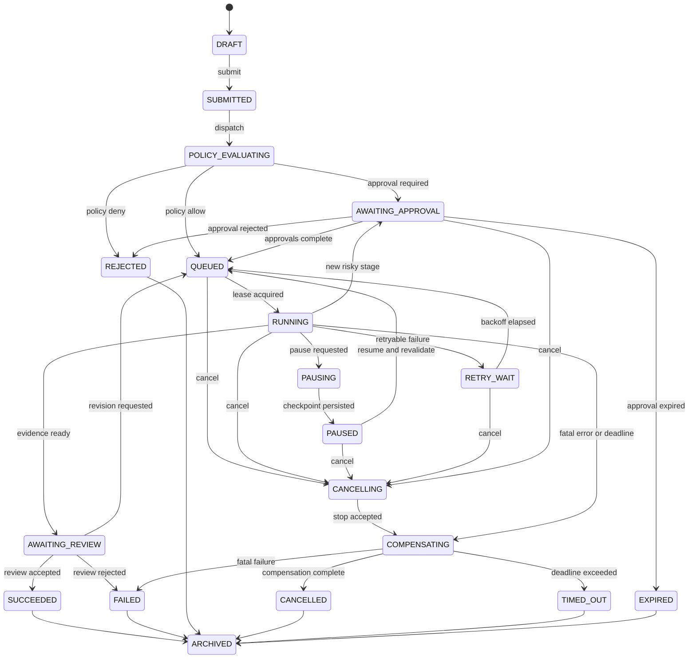

# 任务、阶段、执行与审批状态机

## 1. 状态分层

系统分别维护四种状态，禁止压缩成一个布尔字段：

- `TaskStatus`：用户可见的任务总体生命周期。
- `TaskStageStatus`：工作流节点状态。
- `ExecutionStatus`：某个 Stage 的单次执行尝试。
- `ApprovalStatus`：审批请求生命周期。

Task 状态由 control-plane 唯一写入；Orchestrator、Validation、Sandbox 通过命令/事件请求迁移，不能直接写 Task 表。

## 2. Task 状态

```text
DRAFT
SUBMITTED
POLICY_EVALUATING
AWAITING_APPROVAL
QUEUED
RUNNING
PAUSING
PAUSED
RETRY_WAIT
AWAITING_REVIEW
CANCELLING
COMPENSATING
SUCCEEDED
FAILED
REJECTED
CANCELLED
TIMED_OUT
EXPIRED
ARCHIVED
```



## 3. Task 合法迁移表

| From | 命令/事件 | To | 关键 Guard | 原子副作用 |
|---|---|---|---|---|
| DRAFT | submit | SUBMITTED | 创建人有权限、字段/WorkflowVersion 有效 | version++、TaskEvent、outbox |
| SUBMITTED | evaluate | POLICY_EVALUATING | 未取消、scope revision 存在 | 决策 correlation 写入 |
| POLICY_EVALUATING | policy allowed | QUEUED | 当前 policy/scope digest 匹配 | queue command outbox |
| POLICY_EVALUATING | approval required | AWAITING_APPROVAL | ApprovalRequest 已创建 | approval event |
| POLICY_EVALUATING | policy denied | REJECTED | 明确 reason/policy IDs | 拒绝审计 |
| AWAITING_APPROVAL | approvals complete | QUEUED | quorum、SoD、expiry、digest 均有效 | grant 引用、queue outbox |
| AWAITING_APPROVAL | rejected | REJECTED | 有最终拒绝决定 | 决定不可变、审计 |
| AWAITING_APPROVAL | expired | EXPIRED | 当前时间超过 deadline | grant 不得签发 |
| QUEUED | worker lease acquired | RUNNING | 有效 grant/Scope、fencing token 更高 | Execution attempt、lease |
| RUNNING | request pause | PAUSING | Stage 支持 checkpoint | 取消信号 outbox |
| PAUSING | checkpoint saved | PAUSED | checkpoint hash 已持久化、活动副作用停止 | 释放租约 |
| PAUSED | resume | QUEUED | 重新验证 scope/policy/approval/deadline | 新 queue command |
| RUNNING | retryable failure | RETRY_WAIT | 错误可重试且 attempts 未耗尽 | 记录 attempt、next_run_at |
| RETRY_WAIT | backoff elapsed | QUEUED | 未取消、动态策略仍允许 | queue command |
| RUNNING | risk escalation | AWAITING_APPROVAL | checkpoint 已保存、新 plan revision 冻结 | 新审批请求 |
| RUNNING | evidence ready | AWAITING_REVIEW | 所需 Evidence hash 完整 | review request |
| AWAITING_REVIEW | accepted | SUCCEEDED | Reviewer 有权限且非执行人 | Review/Report command |
| AWAITING_REVIEW | revision required | QUEUED | 新 revision/审批要求已确定 | 新 Stage/attempt |
| 活动态 | cancel | CANCELLING | 调用者有取消权限；终态拒绝 | revoke grant、cancel command |
| CANCELLING | stopped | COMPENSATING | worker 已确认或租约失效 | 资源/副作用补偿命令 |
| COMPENSATING | completed | CANCELLED/FAILED/TIMED_OUT | 补偿结果和原始原因明确 | 终态事件、资源核对 |
| 终态 | archive | ARCHIVED | 报告/审计/保留策略满足 | 归档引用，不删除历史 |

任何不在表中的迁移均返回 `409 invalid_state_transition`，并记录拒绝审计。

## 4. Stage 状态

```text
PENDING → READY → QUEUED → RUNNING → SUCCEEDED
                         ├→ WAITING_APPROVAL → QUEUED
                         ├→ PAUSING → PAUSED → QUEUED
                         ├→ RETRY_WAIT → QUEUED
                         ├→ CANCELLING → CANCELLED
                         ├→ FAILED
                         └→ TIMED_OUT
PENDING/READY → SKIPPED（条件不满足）
FAILED/CANCELLED/TIMED_OUT → COMPENSATED（存在补偿节点时）
```

规则：

- 依赖 Stage 全部 `SUCCEEDED/SKIPPED` 后才能进入 READY。
- Stage 的每次实际运行创建新的 Execution Attempt。
- 条件节点只读取已版本化输入和上游结果，不能读取未审计全局可变状态。
- 补偿按已完成副作用的逆序执行，补偿失败需要人工处置事件，不能隐藏原失败。

## 5. Execution Attempt 状态

```text
CREATED → LEASED → STARTING → RUNNING
RUNNING → SUCCEEDED | RETRYABLE_FAILED | FATAL_FAILED | CANCELLED | TIMED_OUT | LOST
```

字段至少包括：

```text
attempt_number, worker_id, lease_id, fencing_token,
lease_expires_at, heartbeat_at, input_digest, output_digest,
started_at, finished_at, error_class, error_code, retryable
```

`LOST` 表示 worker 心跳与租约超时。新 worker 只能使用更高 fencing token；旧 worker 的迟到写入必须被条件更新拒绝。

## 6. Approval 状态

```text
NOT_REQUIRED
REQUESTED
PARTIALLY_APPROVED
APPROVED
REJECTED
REVOKED
EXPIRED
SUPERSEDED
```

- ApprovalRequest 快照不可修改。
- 任一绑定 digest 变化时旧请求转 `SUPERSEDED`，创建新 request。
- `APPROVED` 只表示审批链完成，不表示可以永久执行；仍需有效 ExecutionGrant 和运行时复验。
- 撤销后未使用 grant 立即失效；运行中任务进入 CANCELLING。

## 7. 并发、一致性和幂等

1. 所有 Task 命令携带 `expected_version`；SQL 使用 `WHERE id=? AND version=?`。
2. 状态变更、TaskEvent、业务 outbox 在一个 PostgreSQL 事务内提交。
3. API 用 `tenant_id + operation + Idempotency-Key` 唯一约束。
4. Consumer inbox 对 `event_id` 唯一约束；重复事件返回已处理结果。
5. 每个聚合事件带 `aggregate_version`；旧版本忽略，版本缺口进入延迟重放。
6. 租约可放 PostgreSQL/Redis，但 fencing token 必须由单调真相源产生并在数据库写入时校验。
7. 不能用 `asyncio.Lock`、`threading.Lock` 或单机文件锁作为分布式正确性的唯一依据。

## 8. 暂停、恢复和取消语义

### 暂停

`pause accepted` 不等于已暂停。只有当前可暂停边界已到达、checkpoint 持久化、活动副作用停止并释放租约后，状态才是 PAUSED。

### 恢复

恢复时重新加载最新策略、Scope、审批、Workflow/Skill 可用性和 deadline。旧 ContextSnapshot 只恢复知识状态，不恢复授权。

### 取消

取消是幂等命令。先撤销未使用 grant，再通知 worker；超时后由平台强制终止 sandbox。无论正常或强制终止都必须执行资源清理和证据/日志封存。

## 9. P0 状态机验收场景

P0 只做模型/契约/纯状态测试，不执行漏洞验证：

- 合法迁移全覆盖和非法迁移拒绝。
- 两个并发命令只有一个基于 expected_version 成功。
- 重复 Idempotency-Key 返回同一 Task。
- 重复/乱序事件不产生重复状态和副作用命令。
- 审批过期、拒绝、撤销、digest 变化均不能进入 RUNNING。
- Pause 只有 checkpoint 持久化后才进入 PAUSED。
- 恢复总是触发重新策略校验。
- Worker 丢失后旧 fencing token 的迟到结果被拒绝。
