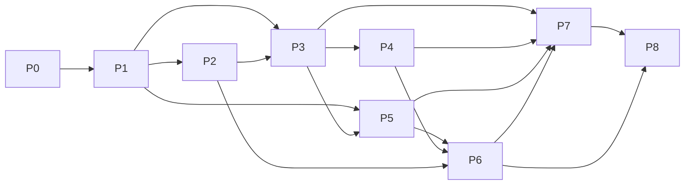

# P0–P8 开发阶段与里程碑

## 1. 执行原则

- 阶段按 P0 → P8 顺序推进；安全基础不可跳过。
- 每个阶段必须是可运行、可测试、可回滚增量。
- `Implemented` 和 `Verified` 分开记录。
- 后续阶段发现 P0 边界不成立时，先更新 ADR、影响分析和迁移方案。
- P0 不实现漏洞验证，P6 之前不得启用验证载荷。

## 2. P0：架构与工程基线

### P0.0 现状冻结

- 盘点代码、配置、依赖、测试和安全不变量。
- 记录旧原型真实测试命令和边界。
- 建立 Git 基线前保存工作区状态，避免覆盖用户文件。

出口：现状评估可追溯；旧原型与目标状态明确分离。

### P0.1 架构与安全设计

- 需求能力矩阵、上下文、服务边界、数据流。
- 领域实体、ER、Task/Approval 状态机。
- RBAC、Policy/Approval、风险登记册和 ADR。

出口：每个需求有唯一责任服务、阶段、数据所有者和证据类型。

### P0.2 Monorepo 与规范

- 创建 `apps/ packages/ infrastructure/ docs/ tests/ tools/`。
- 配置 pnpm workspace/Turborepo 或 Nx、Python/Go workspace。
- 统一格式、静态、类型、错误码、日志、分支和提交规范。

出口：根命令可以调用各 workspace 的真实格式、检查和测试。

### P0.3 契约与数据基线

- 静态 OpenAPI、事件 JSON Schema、共享错误/分页/追踪规范。
- PostgreSQL schema ownership、migration、outbox/inbox 规范。
- 生成前端 SDK 和内部 client，执行 breaking-change 检查。

出口：契约 lint、代码生成、空库 up/down migration 全部真实通过。

### P0.4 本地基础设施

- Compose：PostgreSQL、Redis、NATS JetStream、MinIO、开发 IdP、OTel Collector、Prometheus。
- 健康/就绪、初始化、非默认 secret、备份恢复命令。

出口：干净环境一键启动，依赖健康，固定合成事件链通过。

### P0.5 服务骨架与迁移兼容

- 服务仅实现真实配置校验、health/readiness、数据库/消息/trace smoke。
- 保留旧原型 characterization tests，明确兼容层退出计划。
- 不生成固定返回成功的假业务实现。

出口：每个服务可独立构建；服务账号不能跨 schema；P0 无验证执行路径。

### P0.6 P0 质量门

- 执行格式、静态、类型、契约、迁移、单元、Compose smoke、secret scan。
- 记录成功、失败、跳过及环境依赖，禁止虚报。

出口：满足 `docs/testing/p0-acceptance.md`。

## 3. P1：身份、租户、权限和审计

交付：

- OIDC/JWT、Token 生命周期和 MFA 扩展点；服务身份在 P3 首个消息消费者前接入。
- Tenant、Organization、Project、Membership、八角色 RBAC/ABAC。
- PostgreSQL RLS、统一 repository scope。
- Approver/Auditor 权限边界与配置分层；完整 Policy/Approval 执行面在 P5。
- Audit Service、结构化日志、trace 传播和脱敏。

入口：P0 通过。

出口：跨租户/对象越权测试全通过；通配 admin 被移除；关键管理操作可审计。

## 4. P2：模型网关

交付：Provider/Model/CredentialRef、流式和结构化输出、工具调用协议、限流、重试、熔断、主备、Token/成本、健康和审计。

入口：P1 身份、数据范围、审计可用。

出口：Mock 加一个真实兼容 Provider 的契约测试通过；secret 永不回显；跨租户配额生效。

当前状态：Implemented。已完成 mock/openai-compatible/ollama 适配边界、SSE stream、结构化输出校验、工具 allow-list、request/token quota、retry/circuit/failover、usage/cost、provider health、CredentialRef 和 `model` schema/RLS。真实外部 Provider 与跨租户 live quota 需要 Docker/测试 Provider 恢复后复验。

## 5. P3：任务与 Agent 编排

交付：持久 Task/Stage/Execution 状态机、队列、租约/fencing、幂等/DLQ、Agent/Skill/Workflow 版本、暂停恢复、取消重试、SSE。

入口：P1/P2 权限、审计和模型网关稳定。

出口：多副本竞态、重复消息、worker 丢失和重启恢复测试通过；仅执行无副作用合成 Workflow。

当前状态：Implemented。已完成 SQLite 兼容运行时的持久 Task/Stage/Execution、queue message、lease/fencing、idempotency、DLQ、pause/resume/cancel/retry、SSE 事件流、Agent/Skill/Workflow 版本化注册，以及 PostgreSQL `agent` schema/RLS 迁移。当前执行边界仍限定为 P3 合成工作流和已授权的非破坏性本地/白名单探测；NATS/Redis 多副本真实部署、远程 worker 和生产级调度指标需在 P8 复验。

## 6. P4：上下文与知识库

交付：ContextSnapshot、Memory、污染检测、KnowledgeBase/DocumentVersion/Chunk、扫描、ACL 前置混合检索、重排、引用。

入口：P3 Task/Agent 命名空间稳定。

出口：跨租户/项目检索负向测试、引用溯源、删除/重建和恢复测试通过。

## 7. P5：授权资产、策略和 Sandbox

交付：Asset/Scope/AuthorizationDocument、时间窗/工具/速率、Policy obligations、多级审批、Sandbox Template/Instance、隔离节点、网络和资源策略、异常回收。

入口：P1 审批和审计、P3 调度可用。

出口：仅固定安全命令和网络闭合 smoke；无授权、过期、digest 变化、外网和宿主访问全部拒绝。

## 8. P6：漏洞候选与受控验证

交付：Candidate、ValidationPlan、静态/策略预检、多级审批、合成靶场验证、Evidence、Review、修复建议和报告。

入口：P5 Sandbox 隔离和 Scope 门禁独立验收通过。

出口：只在合成 vulnerable/patched 靶场完成闭环；无武器化、持久化、凭据、破坏、DoS、规避审计或未授权网络能力。

## 9. P7：企业前端

交付：仪表盘、任务中心、模型/Agent/Skill/知识/资产/验证/Sandbox/审批/审计/报告/系统管理，路由分包、虚拟列表、SSE、深色模式、i18n、权限裁剪。

入口：核心后端 OpenAPI 稳定且生成 SDK 可用。

出口：Vitest、Storybook、Playwright、a11y 和 bundle budget 通过；前端隐藏按钮不作为授权证据。

## 10. P8：测试、性能与部署

交付：完整自动化、并发/故障/安全测试、性能 SLO、Docker、Kubernetes/Helm、监控告警、SBOM、镜像签名、备份恢复、部署和验收文档。

入口：P1–P7 功能完成且没有绕过安全基线。

出口：满足 `docs/testing/enterprise-mvp-acceptance.md`，所有声明有实际证据。

## 11. 依赖关系

## 12. 不允许跨越的门禁

- 未完成 P1，不得让 Agent、模型或 Sandbox 处理真实租户数据。
- 未完成 P3，不得用进程内状态承载可恢复长任务。
- 未完成 P5，不得进入 P6 验证执行。
- 未完成 Scope/Policy/Approval/Audit，不得通过“开发模式”旁路高风险操作。
- 未完成企业 MVP 安全测试，不得宣称可生产部署。
