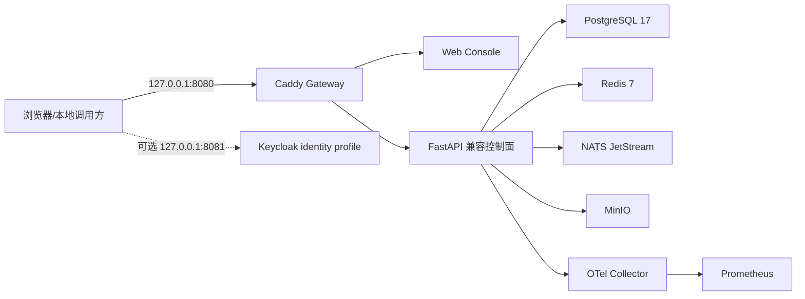

# P0/P1 Docker Compose 运行手册

## 1. 权威文件与边界

企业 P0/P1 平台使用：

```text
infrastructure/docker-compose/platform.yml
infrastructure/docker-compose/.env.platform.example
infrastructure/scripts/{start,stop,backup,restore}.{ps1,sh}
```

根目录 `docker-compose.yml` 属于旧单租户授权靶场原型。它保留合成 vulnerable/patched target 作为旧测试证据，不得用于宣称企业平台、多租户或生产部署完成。P0 平台 Compose 不创建真实漏洞目标，不允许旧执行路径默认开启。

## 2. 服务拓扑



| 服务 | P0/P1 责任 | 持久数据 | 健康检查 |
|---|---|---|---|
| `gateway` | 同源路由、安全响应头、唯一业务入口 | 无 | `/gateway-healthz` |
| `web-console` | P1 OIDC 边界、项目选择和权限裁剪；保留兼容视图 | 无 | `/healthz` |
| `api` | P1 Bearer/RLS 企业 API；compatibility 模式保留旧 SQLite | `api-data`（仅兼容模式） | `/health` |
| `postgres-migrate` | 按 checksum 顺序应用可逆 migration，成功后退出 | `postgres-data` | 退出码 0 |
| `postgres` | P1 IAM/control/audit 真相源和强制 RLS | `postgres-data` | `pg_isready` |
| `redis` | 缓存/限流/可重建状态基础设施 | `redis-data` | 认证 `PING` |
| `nats` | JetStream 事件基础设施 | `nats-data` | JetStream health |
| `minio` | artifacts/reports/audit 对象存储 | `minio-data` | MinIO live health |
| `minio-init` | 幂等建桶、版本化和禁止匿名访问 | 无 | 成功退出 |
| `otel-collector` | OTLP 接收、处理和 Prometheus 暴露 | 无 | Collector health |
| `prometheus` | P0 指标采集和本地保留 | `prometheus-data` | `promtool check healthy` |
| `keycloak` | 默认关闭的开发 OIDC/PKCE Provider；无内置业务用户 | `keycloak-data` | `/health/ready` |

`volume-backup` 和 `volume-restore` 只在 `tools` profile 中由维护脚本按明确命令启动，不是常驻服务；二者无网络、根文件系统只读，仅具有读取或恢复不同服务 UID 所需的最小文件能力。

## 3. 网络与暴露

- `edge`：仅 Gateway 使用的入口网络。
- `management`：仅承载回环发布的 MinIO Console、Prometheus 和可选 Keycloak；不得绑定非回环地址，生产环境需改为受控管理网络。
- `backend`：`internal: true`，承载应用和依赖；数据库、消息和对象存储 API 不直接发布宿主端口。
- 默认宿主绑定是 `127.0.0.1`。改为非回环地址前必须完成 TLS、OIDC、网络 ACL 和威胁评审。
- 公开端口只有 Gateway `8080`、MinIO Console `9001`、Prometheus `9090`，以及启用 `identity` profile 时的 Keycloak `8081`，且均默认回环。
- P0 没有 Sandbox 网络；不得把 Docker Socket、HostNetwork、HostPID 或宿主敏感目录挂入 API。

## 4. 容器安全基线

应用容器使用只读根文件系统、`no-new-privileges`、drop all capabilities、PID/内存/CPU 限额和受限 tmpfs。日志采用大小/文件数轮转。Gateway 移除 Server 头并设置 CSP、frame、referrer、permissions 等浏览器安全头。

基础设施镜像也受资源限制和内部网络约束，但 P0 本地 Compose 不等同于生产隔离：

- Docker 容器共享宿主内核；
- 镜像 tag 必须在 P8 转为 digest 固定、签名和 SBOM 验证；
- MinIO/Prometheus 管理面在生产必须经独立管理网络和身份认证；
- Sandbox 必须部署到 P5 专用 Linux 节点，不能复用本 Compose 的 API 容器。

## 5. 配置与 secret

复制模板：

```powershell
Copy-Item infrastructure/docker-compose/.env.platform.example infrastructure/docker-compose/.env.platform
```

启动脚本会校验：管理员 Key、Fernet master key、PostgreSQL/Redis/NATS/MinIO 凭据存在；占位前缀被拒绝；关键 secret 至少 24 字符；Fernet key 格式正确；数据库和用户命名安全。

`.env.platform` 只用于本机且由 `.gitignore` 排除。生产环境使用 Secret Manager/Vault/KMS 注入，不把 secret 烘焙到镜像、Compose 文件、命令行参数、日志或备份 manifest。

P0 强制：

```text
VULNLAB_EXECUTION_MODE=dry_run
VULNLAB_LEGACY_EXECUTION_ENABLED=false
VULNLAB_ALLOW_PRIVATE_NETWORKS=false（由 Compose 固定）
```

## 6. 配置验证与启动

无需启动容器的静态解析：

```powershell
docker compose --env-file infrastructure/docker-compose/.env.platform.example -f infrastructure/docker-compose/platform.yml config --quiet
```

使用真实本地 env 启动并等待健康：

```powershell
powershell -NoProfile -ExecutionPolicy Bypass -File infrastructure/scripts/start.ps1
docker compose --env-file infrastructure/docker-compose/.env.platform -f infrastructure/docker-compose/platform.yml ps
```

Linux/macOS：

```bash
sh infrastructure/scripts/start.sh infrastructure/docker-compose/.env.platform
```

启动成功的最低检查：

```powershell
Invoke-WebRequest http://127.0.0.1:8080/gateway-healthz -UseBasicParsing
Invoke-WebRequest http://127.0.0.1:8080/health -UseBasicParsing
Invoke-WebRequest http://127.0.0.1:9090/-/healthy -UseBasicParsing
```

API 业务路径仍需要兼容认证。健康成功只证明进程和声明依赖就绪，不证明多租户、消息业务链或漏洞验证能力。

## 7. 可观测与日志

```powershell
docker compose --env-file infrastructure/docker-compose/.env.platform -f infrastructure/docker-compose/platform.yml logs --tail=200 gateway api otel-collector
docker compose --env-file infrastructure/docker-compose/.env.platform -f infrastructure/docker-compose/platform.yml logs --follow --tail=200
```

结构化日志必须包含 service、environment、request/trace ID、level、event 和安全的资源 ID；不得包含认证头、密码、Fernet key、完整模型输入、ExecutionGrant 或原始敏感证据。P0 Collector/Prometheus 配置只提供基线连通性，P8 才完成生产保留、告警路由、SLO 和容量验收。

## 8. 备份

Windows：

```powershell
powershell -NoProfile -ExecutionPolicy Bypass -File infrastructure/scripts/backup.ps1
```

Linux/macOS：

```bash
sh infrastructure/scripts/backup.sh infrastructure/backups infrastructure/docker-compose/.env.platform
```

脚本要求 `api/postgres/redis/nats/minio` 正在运行，生成 PostgreSQL custom dump，并在暂停相关服务后归档 named volumes。输出目录包含 manifest 和 SHA-256 校验文件。备份目录默认位于 Git 忽略的 `infrastructure/backups/`。

本地备份未加密，不能放入同步盘或工单附件。生产备份必须加密、访问受控、跨故障域保存并执行保留/删除策略。

## 9. 恢复

恢复会替换平台数据，必须明确传入备份绝对路径和确认开关：

```powershell
powershell -NoProfile -ExecutionPolicy Bypass -File infrastructure/scripts/restore.ps1 `
  -BackupDirectory 'D:\backups\20260711T083000Z' `
  -ConfirmRestore
```

Linux/macOS：

```bash
sh infrastructure/scripts/restore.sh --yes /absolute/backup/path infrastructure/docker-compose/.env.platform
```

脚本先校验 manifest、文件清单和 SHA-256，并检查归档路径穿越，再停止状态服务、恢复卷和 PostgreSQL、重新启动并等待健康。恢复后还必须执行：

```powershell
python -m pytest tests/contract -q -p no:cacheprovider
docker compose --env-file infrastructure/docker-compose/.env.platform -f infrastructure/docker-compose/platform.yml ps
```

企业验收需要在独立环境测量 RPO/RTO、抽样核对对象 hash、租户计数、Task/Event 序列和审计链；仅生成备份文件不算恢复能力通过。

## 10. 停止、升级与回滚

普通停止不删除卷：

```powershell
powershell -NoProfile -ExecutionPolicy Bypass -File infrastructure/scripts/stop.ps1
```

升级顺序：备份并验证 → `docker compose config` → 执行 expand migration → 拉取/构建固定版本 → `up --wait` → smoke/契约/指标核对 → 完成数据迁移 → 后续发布再 contract。失败时回退应用版本；涉及数据转换时按迁移说明和已验证备份恢复。

不得把 `docker compose down -v` 作为回滚。该命令删除 named volumes，只能用于确认可丢弃的全新开发环境。

## 11. P0/P1 实现与验证状态

截至 2026-07-12，Compose 文件、Windows/POSIX 启停脚本、备份/恢复脚本、健康检查、内部网络、资源/权限限制均已实现。已在 Docker Desktop 28.4 / Compose 2.39 上完成锁定依赖镜像构建、9 个长期服务健康等待、MinIO 初始化、HTTP/鉴权 smoke、PostgreSQL `up/down/up`、跨租户/追加审计负向约束，以及带 SHA-256 manifest 的备份恢复演练；详细证据见 `../P0_ACCEPTANCE_REPORT.md`。

P1 已把 checksum migration runner、独立 `vulnlab_app` 密码、OIDC 配置和企业 API 接入 Compose。开发 Keycloak Realm 使用受管 `tenant_id`、Code+PKCE、短期 token、Refresh Token 轮换、防暴力破解和事件审计；真实浏览器/JWKS 验证与 PostgreSQL RLS 证据见 `../P1_ACCEPTANCE_REPORT.md`。镜像签名、生产密钥管理、跨节点高可用、生产灾备和 Sandbox Linux 隔离属于 P5/P8。
