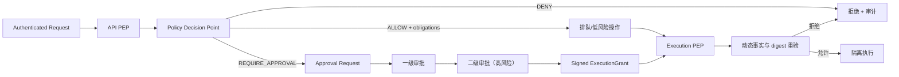

# 策略引擎、多级审批与执行授权

## 1. 安全目标

任何资产探测、命令、工具、Sandbox、验证或数据导出都必须经策略引擎。策略负责收紧已认证主体的权限，不替代 RBAC，也不能批准永久禁止行为。

P0 只定义并测试策略/审批模型，不创建实际 ValidationExecution，不连接目标。

## 2. PDP 与 PEP

- PDP：Control Plane 中的 Policy Decision Point，加载发布的策略版本并作出决定。
- PEP：Gateway、Orchestrator、Validation、Sandbox 和 Report Export 等执行入口。
- `packages/policy-engine`：无 I/O、确定性的规则计算库，可在测试中复现。



## 3. 策略输入

标准决策输入：

```json
{
  "schema_version": "1.0",
  "subject": {
    "user_id": "stable-id",
    "tenant_id": "tenant-id",
    "project_ids": ["project-id"],
    "roles": ["task_operator"],
    "permissions": ["task.execute"],
    "auth_strength": "mfa"
  },
  "action": "sandbox_run.execute",
  "resource": {
    "type": "validation_plan",
    "id": "plan-id",
    "tenant_id": "tenant-id",
    "project_id": "project-id",
    "classification": "restricted",
    "version": 3
  },
  "context": {
    "risk_level": "R3",
    "scope_digest": "sha256:...",
    "plan_digest": "sha256:...",
    "tool_versions": ["safe-http-check@1.2.0"],
    "target": "normalized-target",
    "network": "approved-lab-only",
    "requested_at": "RFC3339",
    "trace_id": "trace-id"
  }
}
```

示例中的 digest 是格式说明，不是有效授权或 secret。

## 4. 策略层级和合并

求值顺序：

```text
平台不可覆盖硬拒绝
→ 平台普通策略
→ 租户策略
→ 项目策略
→ Asset/AuthorizationScope
→ Workflow/Agent/Skill/Model 策略
→ 运行时事实
```

合并规则：

1. deny-overrides：任一有效 DENY 终止允许路径。
2. 子级只能收紧父级，不能扩大目标、工具、网络、时间、资源或数据范围。
3. 多个 quota/rate/resource 限制取最小值。
4. 多个 allowlist 取交集，denylist 取并集。
5. 多个审批要求合并为不低于最高风险的步骤和 quorum。
6. 任何策略解析失败、版本缺失或事实无法验证时失败关闭。

## 5. 决策输出

```text
ALLOW(obligations, policy_bundle_digest)
DENY(reason_code, safe_message, matched_policy_ids)
REQUIRE_APPROVAL(risk_level, steps, obligations, policy_bundle_digest)
```

标准拒绝码：

```text
permission_missing
tenant_scope_mismatch
project_scope_mismatch
target_not_authorized
scope_expired
time_window_closed
tool_not_allowed
network_not_allowed
resource_limit_exceeded
approval_required
approval_invalid
approval_revoked
digest_mismatch
prohibited_operation
audit_unavailable
```

API 返回安全化原因；完整输入和命中规则进入脱敏审计。

## 6. 风险分级

| 级别 | 典型行为 | 审批要求 | 是否可执行 |
|---|---|---|---|
| R0 | 读取普通元数据、查看自身任务 | 不需要 | RBAC/ABAC 允许即可 |
| R1 | 本地静态分析、无网络、固定只读工具 | 一般不需要 | 需已注册工具和资源上限 |
| R2 | 白名单目标的非破坏性主动交互 | 1 名项目审批员 | 仅授权时间窗和低速率 |
| R3 | 受控验证、允许的有限写操作、Restricted 导出 | 项目负责人 + 安全审批员，两级且不同人 | 仅短期 grant、隔离 Sandbox、人工复核 |
| R4 | 持久化、横向移动、凭据窃取、破坏、DoS、规避审计、反取证、未授权网络、宿主执行 | 不可审批 | 永久拒绝 |

系统不提供把 R4 降级为 R3 的配置、管理员开关或 break-glass。

## 7. ApprovalRequest

ApprovalRequest 创建时冻结：

```text
tenant_id, project_id, requester_id, resource/action,
risk_level, scope_id/revision/digest,
plan_id/revision/digest, workflow/skill/tool versions,
policy_bundle_digest, target/network/time/resource obligations,
required steps/quorum, created_at, expires_at
```

Request 不可编辑。任何绑定字段变化都把旧 Request 置为 `SUPERSEDED` 并创建新 revision。

ApprovalStep 定义审批顺序、允许的角色/组、quorum 和超时。ApprovalDecision 是追加记录，包含 approver、决定、理由、时间、请求 digest 和签名。

## 8. 职责分离

- Scope 或 Plan 创建者不能审批自己的对象。
- R3 的两个审批人必须不同。
- R3 的执行人不能是任何审批人。
- Policy 作者不能独自批准降低限制的发布；子级策略根本不能降低平台硬规则。
- 审批人必须在作出决定时仍拥有有效 assignment 和所需认证强度。
- 代理审批必须显式配置委托范围、期限和审计，不能共享账号。

## 9. ExecutionGrant

审批通过后，Control Plane 向内部服务签发短期、最小权限、一次性 ExecutionGrant。浏览器、普通 API 响应和日志中不能出现完整 grant。

Grant 至少绑定：

```text
grant_id, request_id, tenant_id, project_id,
task_id, stage_id, plan_id/revision,
scope_digest, plan_digest, policy_bundle_digest,
allowed tool versions, normalized target/IP/ports/protocol,
network/time/resource obligations,
approval decision IDs, issued_at, expires_at,
nonce, key_id, signature
```

签名私钥由 KMS/HSM 或独立签名服务保护。数据库只保存 nonce hash、状态和必要元数据。

## 10. 执行点复验

Sandbox/Validation PEP 在每次执行和每次网络连接前检查：

1. 服务身份和 grant 签名/key_id。
2. tenant/project/task/stage/plan 一致。
3. expiry、nonce 未使用、未撤销。
4. scope/plan/policy digest 未变化。
5. 当前用户/服务权限和职责分离仍有效。
6. 授权文档、Scope、时间窗仍有效。
7. DNS 所有 A/AAAA 地址均在允许范围，并直接连接已校验 IP。
8. tool/version/argv、文件、网络、端口、速率和资源满足 obligations。
9. 审计 outbox 可在本地事务持久化。

验证通过后以条件更新原子消费 nonce。重复调用必须返回已处理或拒绝，不能产生第二次副作用。

## 11. 撤销、过期和运行中变化

- 撤销 ApprovalRequest 或 Scope 立即使未使用 grant 失效。
- 运行中收到撤销事件时 Task 进入 CANCELLING；Sandbox 停止、封存日志并回收资源。
- Membership/Role 撤销在下一 Stage 和恢复时强制重评；高风险 Stage 可立即取消。
- Policy 新版本默认影响新 grant；平台紧急硬拒绝可撤销匹配的运行 grant。
- 审批超时进入 EXPIRED，不能静默延长；需要新 Request。

## 12. 策略示例

### 永久拒绝

```yaml
id: platform.prohibited-operations.v1
effect: deny
when:
  operation_category:
    any_of:
      - persistence
      - lateral_movement
      - credential_access
      - destructive_action
      - denial_of_service
      - audit_evasion
      - unauthorized_network
      - host_execution
reason_code: prohibited_operation
```

### R2 审批与义务

```yaml
id: tenant.safe-active-validation.v1
effect: require_approval
when:
  risk_level: R2
  environment: authorized_lab
require:
  approver_role: approver
  quorum: 1
obligations:
  network: scope_allowlist_only
  max_requests_per_second: 1
  sandbox_required: true
  evidence_required: true
```

示例只是策略文档格式，不会在 P0 触发实际执行。

## 13. 审计事件

至少记录：Policy 输入 digest、决定、命中 policy IDs、obligations、ApprovalRequest/Step/Decision、grant 签发/撤销/消费、执行点复验、拒绝原因、actor、tenant/project、trace、risk 和 duration。

脱敏后的完整详情进入 Audit Service；普通任务事件只保存安全摘要。

## 14. 验收场景

- 平台硬 DENY 无法被 tenant/project ALLOW 覆盖。
- 子级 allowlist 是上级 allowlist 子集，否则策略发布失败。
- R2 少于一名合格审批人不能签发 grant。
- R3 创建者、审批人或执行人冲突时拒绝。
- scope/plan/policy 任一字节改变导致 digest mismatch。
- 撤销、过期、已消费 nonce、错误目标或工具均拒绝。
- Audit outbox 写入失败时高风险执行不发生。
- P0 测试只验证规则和状态，不启动 SandboxRun 或访问目标。
